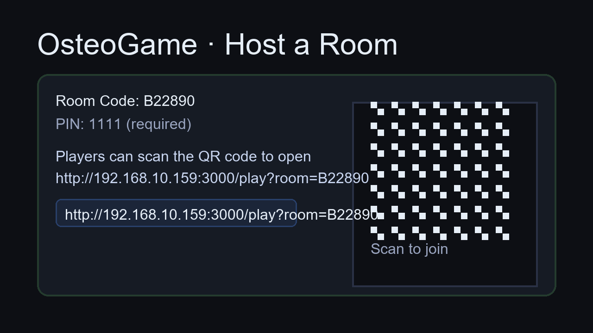

# OsteoGame

Lightweight local-multiplayer experiment inspired by agar.io, themed around osteogenesis. An Express + Socket.IO server keeps rooms in sync, while Phaser renders the client inside the browser.



## Run It Locally

1. **Clone & open**  
   ```powershell
   git clone https://github.com/aliaslandemir/osteogame.git
   cd osteogame
   ```
   Open the folder in VS Code for the best experience.
2. **Install dependencies**  
   Use the vendored toolchain that ships with the repo (no global Node required):
   ```powershell
   .\tools\node-v20.16.0-win-x64\npm.cmd install
   ```
   (If you already have Node 18+ on your PATH, `npm install` works too.)
3. **Start the server**  
   ```powershell
   .\tools\node-v20.16.0-win-x64\node.exe server.js
   ```
   The console will log a default room code and `OsteoGame server listening on http://localhost:3000`.
4. **Open the host dashboard**  
   Visit http://localhost:3000/host. Create a room, optionally set a PIN, and use the **QR base URL** field to point the generated QR codes at your LAN address (for example http://192.168.10.159:3000). Phones on the same Wi-Fi can scan the QR and join instantly.

## Project Layout

- server.js - Express, Socket.IO, game state loop, APIs for room management.
- public/host.html - Host UI including QR code generation and round controls.
- public/play.html + public/client.js - Phaser client bootstrap and gameplay logic.
- public/style.css - Shared styling for host and play pages.
- tools/ - Vendored Node.js runtime for Windows.

## Biomineralization Loop

Players now join by selecting a cell archetype. Each lineage starts with a distinct shape, speed profile, and mineralization bias:

| Archetype           | Shape     | Trait summary                                              |
| ------------------- | --------- | ---------------------------------------------------------- |
| Mesenchymal Capsule | Capsule   | Balanced mover that adapts quickly to vitamin buffs.       |
| Osteoblast Prism    | Square    | Matrix builder that converts nutrients into minerals fast. |
| Osteocyte Dendrite  | Star      | Sensor that thrives near mechanical flow and diagonals.    |
| Osteoclast Apex     | Triangle  | Aggressive resorber with high velocity but higher decay.   |

Vitamin pellets deliver temporary cues:

| Intake      | Shape    | Effect highlights                              |
| ----------- | -------- | ---------------------------------------------- |
| Vitamin C   | Triangle | Speed burst and diagonal agility.              |
| Vitamin D   | Diamond  | Mineralization pulse and faster differentiation. |
| Vitamin K   | Hex      | Stability boost and smoother diagonal control. |
| Steroid     | Square   | Large mass gain, slower handling, stronger captures. |

Environmental cues guide differentiation:

| Cue         | Visual    | Primary influence                             |
| ----------- | --------- | --------------------------------------------- |
| Growth      | Circle    | Accelerates progenitor to osteoblast progress. |
| Nutrient    | Hex       | Mass gain and metabolic support.              |
| Mineral     | Square    | Osteoblasts deposit hydroxyapatite faster.    |
| Mechanical  | Diamond   | Raises elongation and directional bias.       |
| Hormonal    | Triangle  | Temporarily amplifies osteogenic signaling.   |
| Flow        | Capsule   | Shear stress buff that reduces decay.         |

The HUD now highlights culture-wide biomineralization, the leading lineage, and recent vitamin intakes so collaborators can coordinate supply chains in real time.

## Common Tasks

- **Restart the simulation**: on the host page, use *Regenerate Cues & Pellets* and *Start Round*.
- **Change defaults**: edit constants in `server.js` (world size, pellet counts, round timing). Keep `public/client.js` in sync for visuals.
- **Invite players**: share the QR or copy link after creating a room. Provide the PIN if set.

Have fun exploring morphogenesis mayhem! :)
