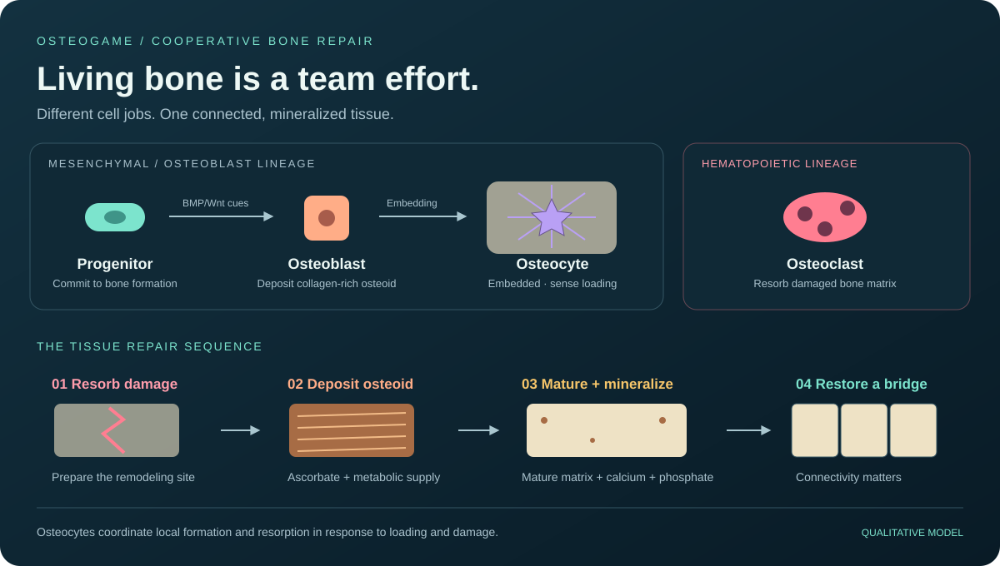
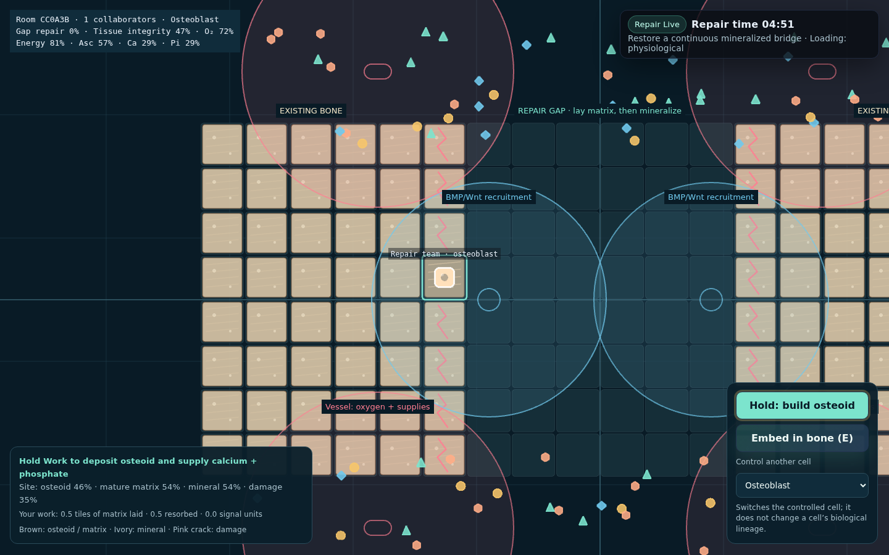

# OsteoGame

**Repair bone. Work as a tissue.** A cooperative browser game about osteogenesis and coordinated bone remodeling. Clear damaged matrix, deposit collagen-rich osteoid, and mineralize a continuous bone bridge.



<details>
<summary>See the game in action</summary>



</details>

## Run locally

Use **Node.js 22+**:

```sh
npm ci
npm start
```

Open [localhost:3000](http://localhost:3000). No build step, database, account, or browser CDN connection is needed.

1. Open [/host](http://localhost:3000/host), create a room, and share its QR/link. A PIN is optional.
2. Players join at [/play](http://localhost:3000/play) and choose a starting cell job.
3. The host starts a five-second countdown followed by a **five-minute repair round**.
4. Work together to restore a continuous path of intact mineralized tissue from the left bone fragment to the right.

For phones, set **QR base URL** to the host’s reachable LAN address (e.g. `http://192.168.1.20:3000`). Allow the server port through your firewall. WSL may need Windows port forwarding or mirrored networking for other devices to connect.

## Controls and a first repair

| Control | Action |
| --- | --- |
| WASD / arrow keys / drag | Move the controlled motile cell over the scaffold |
| Hold Space / hold the Work button | Perform that cell’s tissue job; locomotion pauses while working |
| E / Embed button | Embed an osteoblast in mature bone, or observe another existing osteocyte |
| Control another cell | Take over a different cell job; preserves your supplies and contributions |

For a first round, work along one row of the gap:

1. Use an **osteoclast** to clear the pink cracked tiles at the fracture margins.
2. Use an **osteoblast** on those sites and the empty tiles between them. Hold Work to deposit osteoid and supply calcium and phosphate.
3. Allow the brown osteoid to mature; ivory mineral appears when mature matrix and both ions are present.
4. Refill at the **red vessel zones** above or below the scaffold. Continue along adjacent tiles until the two fragments connect.
5. An **embedded osteocyte** can support nearby formation under physiological loading and mark damaged sites for faster resorption.

Solo players can cover different jobs using **Control another cell**. This is a change of the player’s controlled cell, not conversion between biological lineages. Contributions are reported as matrix deposited, damaged matrix resorbed, damage cleared, and signaling work. There is one shared tissue objective rather than an individual mineral leaderboard.

## Biological rules

| Cell | In-game role | Lineage / constraints |
| --- | --- | --- |
| Mesenchymal progenitor | Commits in blue BMP/Wnt recruitment zones, then becomes an osteoblast | Mesenchymal lineage; needs adequate oxygen and energy |
| Osteoblast | Uses energy and ascorbate to deposit collagen-rich **osteoid**, supplies Ca + Pi to that site | Can embed as an osteocyte only in mature, intact mineralized matrix |
| Osteocyte | Remains embedded and signals neighboring tissue in response to loading and damage | Osteoblast-derived; cannot roam to collect resources |
| Osteoclast | Resorbs damaged matrix and its mineral, opening space for replacement | Separate hematopoietic/monocyte lineage; healthy tissue inhibits resorption |

Cells do not eat each other, gain body mass from mineral, or become osteoblasts regardless of lineage. Mineral is a property of the **extracellular tissue**, not a player inventory score.

Each tissue site tracks:

- **Osteoid:** recently deposited, unmineralized organic matrix.
- **Mature matrix:** organic matrix available for mineral deposition after a maturation delay.
- **Mineral:** limited by the amount of mature matrix and the availability of both calcium and phosphate.
- **Damage:** inhibits formation until a resorptive cell prepares the site.
- **Local signals:** short-lived formation or resorption signals from embedded osteocytes.

Ascorbate supports collagen-rich matrix formation; calcium and phosphate are mineral substrates; metabolic supply restores energy. Pickups refill inventories. They never create mineral directly. Vascular supply zones replenish these substrates, while a coarse distance-based oxygen field constrains cell work.

Damage-targeted resorption is a game constraint; real osteoclasts also participate in normal turnover of otherwise healthy bone.

The host can change **mechanical loading** during a round:

| Regime | Model response |
| --- | --- |
| Resting / unloading | Weaker osteocyte formation stimulus |
| Physiological | Osteocyte signaling supports local matrix deposition and mineralization |
| Overload | Accumulating microdamage creates new remodeling demands |

**Success is structural.** A four-neighbor path must connect the two fragments through sites with sufficient mature matrix, mineral, and low damage. Scattered mineralized islands do not win. The HUD also reports gap repair and a coarse integrity index. A connected bridge ends the round in team success; otherwise the tissue is frozen at time-up for review. Restarting creates a fresh gap and resets contributions and inventories.

## Scientific basis and simplifications

The mechanics follow the qualitative sequence of resorption, organic matrix formation, and subsequent mineralization described by [NIAMS: What Is Bone?](https://www.niams.nih.gov/health-topics/what-bone). Osteocyte signaling and load sensing are central to the [NIAMS Skeletal Mechanobiology Laboratory’s research](https://www.niams.nih.gov/skeletal-mechanobiology-laboratory).

The link between ascorbate and osteoblast collagen matrix formation is supported by [Franceschi et al., 1994](https://pubmed.ncbi.nlm.nih.gov/8079660/). The extracellular collagen/mineral structure is supported by [MC3T3-E1 mineralization experiments](https://pmc.ncbi.nlm.nih.gov/articles/PMC6342200/).

This is a **qualitative educational model**, with accelerated time and dimensionless fractions. Tile thresholds, loading levels, oxygen fields, and resource budgets are gameplay choices, not measured biological rates. BMP/Wnt and local signals are abstractions, not molecular pathway simulations. The integrity percentage is not a physical strength prediction.

The scenario resembles simplified direct bone formation and remodeling on a scaffold. It omits cartilage callus formation, inflammation, vascular invasion, detailed RANKL/OPG and sclerostin regulation, osteoclast precursor fusion, cell death, matrix vesicles, and systemic hormone effects. It does not represent the complete process of fracture healing or predict treatment outcomes. Vitamins D/K and steroids are no longer arcade speed/mass powers.

## Development

```sh
npm run check
npm test
npm audit
```

Tests verify lineage restrictions, delayed extracellular mineralization, substrate requirements, resorption/formation coupling, osteocyte immobility and signaling, overload damage, bounded quantities, bridge connectivity, round resets, and HTTP/Socket.IO behavior. GitHub Actions runs checks on Node.js 22 and 24.

| File | Purpose |
| --- | --- |
| `bone.js` | Tissue grid, differentiation, cell work, mineralization, damage, connectivity |
| `server.js` | Room lifecycle, input validation, resources, authoritative simulation, network snapshots |
| `public/client.js` | Phaser tissue rendering, cell controls, interpolation, HUD |
| `public/host.html` / `host.js` | QR sharing, round controls, loading regime, tissue status |
| `public/images/osteogame-overview.svg` | Original cell lineage and remodeling figure |
| `test/bone.test.js` / `game.test.js` | Biological rule and network regression tests |

Player snapshots run at **20 Hz**, and compact tissue snapshots at **5 Hz**. Static cue definitions are sent when the world changes. Off-screen drawing is culled. Empty rooms skip simulation work and expire after one hour. Up to 48 players can join a room; the server allows 100 rooms. Rooms and scores are in memory and disappear on restart.

Configure `PORT` and optional default `ROOM_PIN` in `.env` using `.env.example`. Biological/gameplay constants live in `bone.js` and `server.js`. The original Windows runtime in `tools/` is retained; standard Node.js 22+ is the supported setup.

The app is for a trusted LAN. A PIN restricts entry, but host control endpoints are not authenticated. Public hosting requires host authorization and request rate limits, plus a Node host that supports WebSockets. GitHub Pages cannot run the server.

See [CONTRIBUTING.md](CONTRIBUTING.md). License: [ISC](LICENSE); dependencies retain their own licenses.
